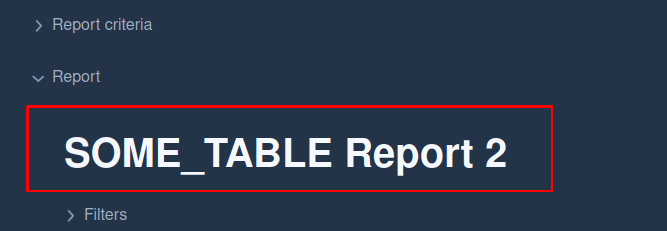
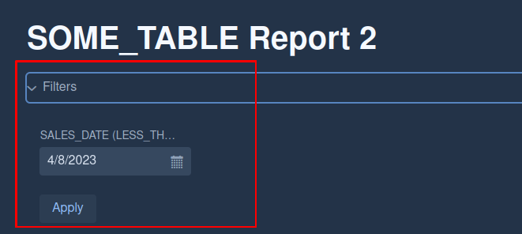
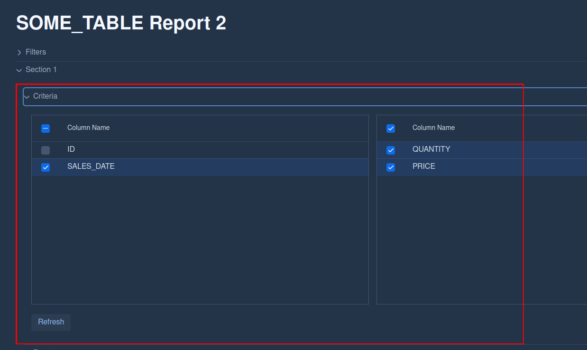
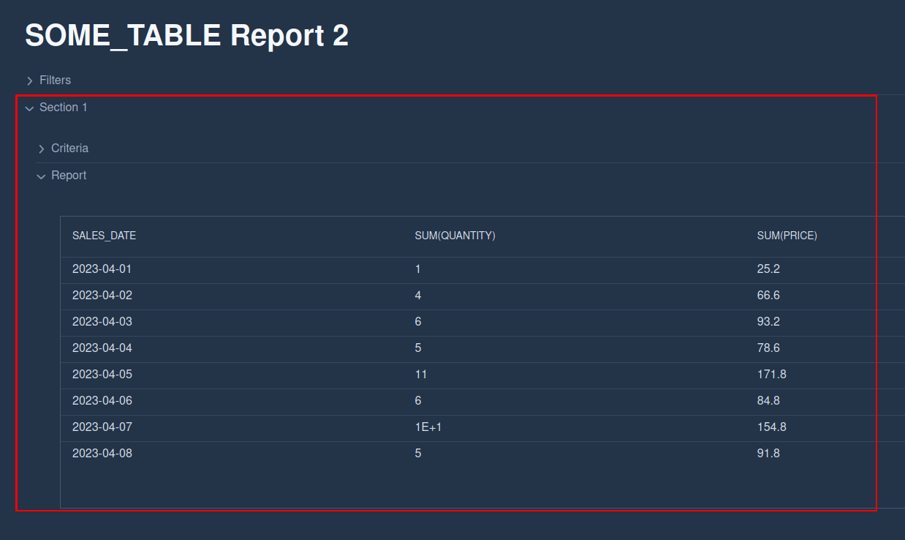
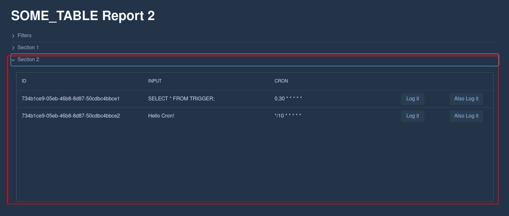

# Report Template

> <details>
> <summary>Sample report (FULL JSON)</summary>
> 
> ```json
> {
>   "name": "SOME_TABLE Report 2",
>   "owner": "me",
>   "visibility": {
>     "type": "PUBLIC",
>     "value": null
>   },
>   "globalFilters": [
>     {
>       "column": "SALES_DATE",
>       "operator": "LESS_THAN_OR_EQUAL",
>       "value": "TODAY"
>     }
>   ],
>   "sections": [
>     {
>       "name": "Section 1",
>       "type": "REPORT",
>       "query": "SELECT ID, SALES_DATE, QUANTITY, PRICE FROM SOME_TABLE;",
>       "columns": [
>         {
>           "name": "ID",
>           "type": "NUMBER"
>         },
>         {
>           "name": "SALES_DATE",
>           "type": "DATE"
>         },
>         {
>           "name": "QUANTITY",
>           "type": "NUMBER"
>         },
>         {
>           "name": "PRICE",
>           "type": "NUMBER"
>         }
>       ],
>       "report": {
>         "dimensions": [
>           "ID",
>           "SALES_DATE"
>         ],
>         "facts": [
>           "QUANTITY",
>           "PRICE"
>         ],
>         "initialReport": {
>           "dimensions": [
>             "SALES_DATE"
>           ],
>           "facts": [
>             "QUANTITY",
>             "PRICE"
>           ]
>         }
>       },
>       "dataGrid": null,
>       "params": null
>     },
>     {
>       "name": "Section 2",
>       "type": "DATA_GRID",
>       "query": "SELECT ID, INPUT, CRON FROM TRIGGER;",
>       "columns": [
>         {
>           "name": "ID",
>           "type": "TEXT"
>         },
>         {
>           "name": "INPUT",
>           "type": "TEXT"
>         },
>         {
>           "name": "CRON",
>           "type": "TEXT"
>         }
>       ],
>       "report": null,
>       "dataGrid": {
>         "actions": [
>           {
>             "name": "Log it",
>             "action": "LOG",
>             "url": "ID[${ID}] CRON[${CRON}] SQL[${SQL}]",
>             "type": null,
>             "headers": null,
>             "data": [
>               {
>                 "ID": "ID"
>               },
>               {
>                 "SQL": "INPUT"
>               },
>               {
>                 "CRON": "CRON"
>               }
>             ]
>           },
>           {
>             "name": "Also Log it",
>             "action": "LOG",
>             "url": "https://localhiost:8080/get/${ID}/delete",
>             "type": null,
>             "headers": null,
>             "data": [
>               {
>                 "ID": "ID"
>               }
>             ]
>           }
>         ]
>       },
>       "params": null
>     }
>   ]
> }
> ```
> 
> </details>
> 
> 
> 
> ## Template objects:
> 
> - `name` - Name of the report. Displayed at the top of report section.
> 
> - 
> 
> - `owner` - person responsible for maintenance
> 
> - `visibility` - defines, who has access to view the report
>   
>   - `type` - PRIVATE, PUBLIC, GROUP
>   
>   - `value` - Required for GROUP type (specifies group name)
> 
> - `globalFilters` - List of `Filter`s that will be applied to all sections.
>   Filters section will be deisplayed as first element below the report name header.
>   
>   - `column` - name of the column to be used (Has to be returned by the section query)
>   
>   - `operator` - logical operator 
>     
>     - `EQUAL`
>     
>     - `NOT_EQUAL`
>     
>     - `GREATER_THAN`
>     
>     - `LESS_THAN`
>     
>     - `GREATER_THAN_OR_EQUAL`
>     
>     - `LESS_THAN_OR_EQUAL`
>   
>   - `value` - string value of the corresponding column type to be used in filter ()
>     
>     - a relative value TODAY{+/-x} can be used).
>       
>       - String value = "2023-04-06"
>       
>       - String value = "TODAY"
>       
>       - String value = "TODAY-7"
>   
>   - `columnType` - type of the column
>     
>     - `TEXT`
>     
>     - `NUMBER`
>     
>     - `DATE`
>     
>     - `DATETIME`
>   
>   - 
> 
> - `sections` - List of `Section`s (sub-reports) to be displayed
>   
>   - `name` - name of the section.
>     Displayed below Filters section.
>   
>   - `SectionType` - type of the section. Each type has specific properties.
>     
>     - `REPORT` - displays aggregated data. Has additional section to select column visibility.
>     
>     - `DATA_GRID` - plain display of data. Allows creation of action buttons bound to each row.
>   
>   - `query` - SQL query to be used in section generation.
>     REPORT sections will automatically aggregate data. In most cases aggregation won't be needed in the query
>   
>   - `columns` - list of `Column`s that are returned by the query
>     
>     - `name` - name of the column
>     
>     - `type` - columns data type
>       
>       - `TEXT`
>       
>       - `NUMBER`
>       
>       - `DATE`
>       
>       - `DATETIME`
>   
>   - `report` - `REPORT` type specific attributes.
>     
>     - `dimensions` - List of column names that will be used as reports dimensions
>     
>     - `facts` - List of column names that will be used as reports fact values
>     
>     - `initialReport` - Initial view when report is loaded
>       
>       - `dimensions` - List of column names that will be used as initial reports dimensions
>       
>       - `facts` - List of column names that will be used as initial reports fact values
>       
>       - 
>     
>     - 
>   
>   - `dataGrid` - `DATA_GRID` type specific attributes.
>     
>     - `actions` - List of `Action`s to be bound to each element of the result set. Each element will create a button that executes specified action.
>       
>       - `name` - Name to be displayed on the button.
>       
>       - `action` - Action to be performed.
>         
>         - `LOG`
>         
>         - `TEAMS_MESSAGE`
>         
>         - `REST`
>       
>       - `type` - `Action`.`REST` specific. Type of rest call (POST, GET, ...)
>       
>       - `url` - Url for action with ${VALUE} markers for substitution.
>         
>         - "Log: ${ID}"
>         
>         - "https://localhost:8080/endpointName/${ID}/delete"
>       
>       - `headers` - Headers to add to the REST call
>         
>         - {"namer": "value"}
>       
>       - `data` - Values for substitution in url
>         
>         - {"valueToReplaceInURL": "columnNameFromQuery"}
>     
>     - 
>       
>       - action url -> "url": "https://localhost:8080/get/${ID}/delete",
>       
>       - result -> "https://localhost:8080/get/734b1ce9-05eb-46b8-8d87-50cdbc4bbce2/delete"
>   
>   - `params` - List of `Param`eters to be applied only on this section.
>     
>     - `name` - name of the parameter
>     
>     - `value` - value of the parameter
